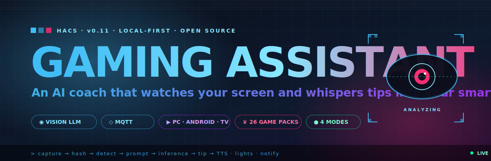

<div align="center">



<br/>

# 🎮 Gaming Assistant for Home Assistant

**An AI coach that watches your screen and whispers tips into your smart home.**

Local Vision LLM (Ollama) or cloud AI (GPT-4o, Gemini, DeepSeek, Groq) analyzes your gameplay — frame by frame — and pushes context-aware tips, voice lines, and triggers straight into Home Assistant. RGB lights react. TTS reads tips aloud. Spoilers? You control them.

[](https://github.com/hacs/integration)
[](https://github.com/Chance-Konstruktion/ha-gaming-assistant/releases)
[](https://github.com/Chance-Konstruktion/ha-gaming-assistant/actions)
[](LICENSE)
[](https://www.python.org/)

[**🚀 Quick Start**](#-quick-start) · [**🧠 How it works**](#-architecture) · [**🕹 Supported games**](#-supported-games) · [**🗺 Roadmap**](ROADMAP.md) · [**🤝 Contribute**](#-contributing)

</div>

---

## 💥 Why this exists

You game. You have a Home Assistant box sitting in the corner. Cloud "AI coaches" want your screen, your account, and a subscription. **Why not run the whole thing yourself?**

> **Your GPU, your tips, your house.** No SaaS. No telemetry. No spoilers you didn't ask for.

<table>
<tr>
<td width="33%" valign="top">

### 🧿 Sees your game
A Vision LLM looks at JPEG frames over MQTT and produces real tips — not generic walkthrough text.

</td>
<td width="33%" valign="top">

### 🏠 Lives in your house
Native HACS integration. Tips, status, sensors, services — all exposed to Lovelace, automations, and HA Assist.

</td>
<td width="33%" valign="top">

### 🔒 Stays local
Ollama on your gaming rig or NAS. Cloud backends optional, never required. Zero data leaves your LAN unless you say so.

</td>
</tr>
</table>

---

## ✨ Highlights

<table>
<tr>
<td width="50%" valign="top">

**🎯 Four assistant modes**
`Coach` · `Co-Player` · `Opponent` · `Analyst` — switch live from the dashboard or by voice.

**🃏 Tabletop + console too**
Chess, Poker, Catan, UNO via webcam. Consoles via HDMI capture or IP webcam. No PC needed.

**🎙 HA Assist conversation agent**
"Wechsel modus auf gegner." "How do I beat this boss?" Both work.

**📦 26+ community prompt packs**
Elden Ring, BG3, CS2, Zelda, Hearthstone, MTG Arena, FIFA, Civ VI, Rocket League… auto-downloaded from a sibling repo on first start (cached locally) and hot-reloaded on demand.

</td>
<td width="50%" valign="top">

**🙈 7-category spoiler control**
Story, items, enemies, bosses, locations, lore, mechanics — each at `none / low / medium / high`, persisted per game.

**🧠 Game State Engine**
Tracks structured state across frames (health declining, phase changes, momentum) — your tips know what *just* happened, not only what's on screen.

**⚡ Pluggable backends**
Ollama · LM Studio · GPT-4o · Gemini · DeepSeek · Groq. Vision or text-only. Raspberry Pi friendly.

**🟢 Optional YOLO + OCR workers**
Real-time object detection (CUDA / NCNN / Hailo-8L / TFLite) and HUD number OCR (health/ammo/score) — both feed *measured* values straight into the Game State Engine.

</td>
</tr>
</table>

---

## 🧠 Architecture

`v260618` is a **Thin Client** design. The gaming device only captures and ships frames. All intelligence lives in Home Assistant.

```
┌─────────────────────────────────────────┐        ┌───────────────────────────────────────────────┐
│  CAPTURE AGENT  (you on the couch)      │  MQTT  │  HOME ASSISTANT  (the brain)                  │
│  ─────────────────────────────          │ ─────► │  ─────────────────────────────                │
│  • Windows / Linux / macOS              │  jpeg  │  Image listener  →  hash dedupe               │
│  • Android / Android TV / Google TV     │        │  Game detection  →  Game State Engine         │
│  • IP webcam · HDMI bridge · camera     │        │  Trend detection (health, phase, momentum)    │
│  • JPEG compress · backpressure         │        │  Spoiler policy  →  Prompt builder            │
└─────────────────────────────────────────┘        │  LLM backend  →  Tip                          │
                                                   │  Sensors · Services · Conversation agent      │
                                                   └─────────────┬─────────────────────────────────┘
                                                                 │
                                          ┌──────────────────────┼──────────────────────┐
                                          ▼                      ▼                      ▼
                                   🔊  TTS / Piper        💡  RGB scenes         📱  Notifications
                                   "Watch the left."      red on low HP          mobile_app push
```

<details>
<summary><b>Optional: YOLO Worker (external, GPU/NPU)</b></summary>

```
   Game State Engine  ◄──  Detections (MQTT)  ◄──  YOLO Worker
                                                   ├─ CUDA  (PC GPU)
                                                   ├─ NCNN  (Raspberry Pi)
                                                   ├─ Hailo-8L  (NPU)
                                                   └─ TFLite  (mobile)
```

Adds structured object detection (enemies, items, UI elements) on top of the Vision LLM. Pure upgrade; the rest works without it.

</details>

<details>
<summary><b>Legacy mode (v0.2 / v0.3 workers)</b></summary>

Old workers that publish finished tips to `gaming_assistant/tip` still work in passthrough. Migrate when you're ready — see [Migration](#-migration-from-v02v03).

</details>

---

## 🚀 Quick Start

### 1 — Install via HACS

```text
HACS → Integrations → ⋯ → Custom repositories
  URL:   https://github.com/Chance-Konstruktion/ha-gaming-assistant
  Type:  Integration
```

Restart Home Assistant.

### 2 — Add the integration

`Settings → Devices & Services → Add Integration → Gaming Assistant`

A 6-step config flow asks for: **LLM provider → connection → model + interval → spoiler default → camera → voice**. Cloud providers need an API key. Connection is validated before the flow closes.

### 3 — Fire up a capture agent

```bash
# Pick your platform — they all speak MQTT
pip install -r worker/requirements-capture.txt

python worker/capture_agent.py \
  --broker 192.168.1.10 \
  --client-id gaming-pc \
  --interval 5 \
  --quality 75
```

Tips start landing on `sensor.gaming_assistant_tip` within seconds.

> 💡 **Non-technical?** Build the Windows GUI: `cd worker && build_exe.bat` → run `GamingAssistant.exe`. Enter broker IP, hit Start. Done.

---

## 🤖 AI backends

| Backend | Type | Vision | Notes |
| :--- | :---: | :---: | :--- |
| **Ollama** | 🏠 Local | ✅ | Default. No API key. Recommended. |
| **LM Studio** | 🏠 Local | ✅ | OpenAI-compatible endpoint |
| **OpenAI GPT-4o** | ☁ Cloud | ✅ | Best quality, paid |
| **Google Gemini** | ☁ Cloud | ✅ | Free tier available |
| **DeepSeek** | ☁ Cloud | ⚪ | Cheap, text-only |
| **Groq** | ☁ Cloud | ⚪ | Ultra-fast inference, text-only |

> ⚪ Text-only backends never receive images — they get structured game state + context descriptions instead. Great for Raspberry Pi setups without a GPU.

### Recommended local vision models (Ollama)

| Model | VRAM | Notes |
| :--- | :---: | :--- |
| `qwen2.5vl` | ~8 GB | **Best quality**, recommended |
| `llava` | ~8 GB | Good general purpose |
| `bakllava` | ~6 GB | Lighter option |
| `llama3.2-vision` | ~10 GB | Excellent, needs more VRAM |
| `ministral:3b` | ~2 GB | Lightweight, low-VRAM rigs |

> 🥧 **Raspberry Pi / no GPU?** Use Gemini free tier or DeepSeek. Integration runs on anything that runs Home Assistant.

---

## 🕹 Supported games

<table>
<tr><td valign="top">

**🎮 Video (19)**

Elden Ring · Dark Souls III · Baldur's Gate 3 · Minecraft · Zelda: TotK · Zelda: BotW · Stardew Valley · Hades · Mario Kart · CS2 · League of Legends · Valorant · Fortnite · Rocket League · FIFA / EA FC · Civ VI · Cyberpunk 2077 · The Witcher 3 · Diablo IV

</td><td valign="top">

**🃏 Card / Strategy (3)**

Hearthstone · MTG Arena · Among Us

**♟ Tabletop (4)**

Chess · Poker · Catan · UNO

</td></tr>
</table>

Community packs are pulled from [`ha-gaming-assistant-prompts`](https://github.com/Chance-Konstruktion/ha-gaming-assistant-prompts) and hot-reloaded via the `gaming_assistant.refresh_prompt_packs` service. Roll your own with [`docs/pack_authoring.md`](docs/pack_authoring.md) — schema, validation, local testing, the full workflow. A `_template.json` ships in the repo.

---

## 🎚 Feature deep-dive

<details>
<summary><b>🎯 Assistant Modes</b> — Coach, Co-Player, Opponent, Analyst</summary>

Switch live from the dashboard via `select.gaming_assistant_assistant_mode`, or:

```yaml
action: select.select_option
target:
  entity_id: select.gaming_assistant_assistant_mode
data:
  option: opponent
```

| Mode | What it does |
| :--- | :--- |
| **Coach** | Tips and strategy to help you win *(default)* |
| **Co-Player** | Collaborative teammate, suggests joint moves |
| **Opponent** | Plays against you, announces its moves out loud |
| **Analyst** | Neutral commentator, doesn't take sides |

</details>

<details>
<summary><b>🙈 Spoiler System</b> — 7 categories, 4 levels, per-game profiles</summary>

Control what the AI is allowed to reveal across **story · items · enemies · bosses · locations · lore · mechanics** — each at `none / low / medium / high`.

```yaml
service: gaming_assistant.set_spoiler_level
data:
  category: bosses
  level: none
  game: "Elden Ring"   # optional
```

Set everything at once with a profile:

```yaml
service: gaming_assistant.set_spoiler_profile
data:
  game: "Elden Ring"
  level: none
```

Profiles persist across HA restarts. Add `clear: true` to wipe.

</details>

<details>
<summary><b>❓ Ask Mode</b> — talk to it like ChatGPT, with or without a screenshot</summary>

```yaml
service: gaming_assistant.ask
data:
  question: "How do I beat this boss?"
  game_hint: "Elden Ring"
```

With a screenshot:

```yaml
service: gaming_assistant.ask
data:
  question: "What item is on the ground here?"
  image_path: /config/www/screenshot.jpg
```

</details>

<details>
<summary><b>♟ Tabletop Support</b> — point a camera at your board</summary>

```yaml
service: gaming_assistant.watch_camera
data:
  entity_id: camera.board_game_cam
  game_hint: "Chess"
  client_type: tabletop
  interval: 10
```

Stop with `gaming_assistant.stop_watch_camera`. Built-in packs for Chess, Poker, Catan, UNO.

</details>

<details>
<summary><b>🔊 Voice (TTS) + 🗣 Voice Control (HA Assist)</b></summary>

**Auto-announce:** Flip `switch.gaming_assistant_auto_announce` on — every new tip is spoken via your configured TTS engine and media player.

**Manual:**
```yaml
service: gaming_assistant.announce
data:
  tts_entity: tts.piper
  media_player_entity_id: media_player.living_room
```

**Conversation agent:** Pick *Gaming Assistant* as the conversation agent in `Settings → Voice assistants`. Built-in commands (EN + DE):

| English | Deutsch | Action |
| :--- | :--- | :--- |
| "switch mode to opponent" | "wechsel modus auf gegner" | Change mode |
| "set spoiler to low" | "ändere spoiler auf niedrig" | Change spoiler level |
| "start" / "stop" | "starte" / "stoppe" | Pause/resume capture |
| "current tip" | "aktueller tipp" | Read latest tip |
| "session summary" | "zusammenfassung" | Read session summary |
| "analyze" | "analysiere" | Force immediate analysis |

Anything else is forwarded to the LLM as a free-form question. *"Was ist mein nächster Zug?"* works.

</details>

<details>
<summary><b>📝 Session Summaries</b> — wrap-up after every session</summary>

After 5 minutes of inactivity, the integration can auto-summarize the session's key insights (3+ tips required). The result lands in `sensor.gaming_assistant_session_summary`. A `gaming_assistant_session_ended` event fires for automations.

Manual:
```yaml
service: gaming_assistant.summarize_session
data:
  game: "Elden Ring"
```

</details>

<details>
<summary><b>📡 Event-based automations</b> — every tip fires <code>gaming_assistant_new_tip</code></summary>

```yaml
trigger:
  - platform: event
    event_type: gaming_assistant_new_tip
action:
  - service: notify.mobile_app_your_phone
    data:
      title: "Gaming Tip ({{ trigger.event.data.game }})"
      message: "{{ trigger.event.data.tip }}"
```

Event payload includes `tip`, `game`, `client_id`, `assistant_mode`. Pair with light scenes, scripts, or whatever HA can do.

</details>

---

## 📦 Capture agents

| Agent | Script | Good for |
| :--- | :--- | :--- |
| **PC** | `worker/capture_agent.py` | Windows / Linux / macOS gaming rigs |
| **Android** | `worker/capture_agent_android.py` | Phones via ADB (USB or Wi-Fi) |
| **Android TV / Google TV** | `worker/capture_agent_android_tv.py` | Steam Link, GeForce NOW, Xbox Game Pass on TV |
| **IP Webcam** | `worker/capture_agent_ipcam.py` | Phone aimed at a TV/monitor, console gaming |
| **HDMI Bridge** | `worker/capture_agent_bridge.py` | USB HDMI dongle on a Raspberry Pi → any console |
| **Windows GUI** | `GamingAssistant.exe` *(built via `worker/build_exe.bat`)* | Non-technical users — one click to start |

<details>
<summary><b>CLI cheat sheet</b></summary>

**PC agent (`capture_agent.py`):**

| Arg | Default | Notes |
| :--- | :---: | :--- |
| `--broker` | *(required)* | MQTT broker IP |
| `--port` | `1883` | MQTT port |
| `--user` / `--password` | | MQTT auth |
| `--client-id` | hostname | Unique client ID |
| `--interval` | `5` | Seconds between captures |
| `--quality` | `75` | JPEG quality (1–100) |
| `--resize` | `960x540` | Image dimensions |
| `--monitor` | `1` | Monitor index |
| `--game-hint` | | Manual game name (Wayland fallback) |
| `--detect-change` | off | Skip unchanged frames |

> **Linux note:** PC agent uses `xprop` for window-title detection on X11. On Wayland, auto-detection is unavailable — use `--game-hint`.

**Android agent** — same as PC, plus:

| Arg | Notes |
| :--- | :--- |
| `--device` | ADB device serial or `IP:port` |

**Android TV agent** — same as Android, plus `--game-hint` (for streaming apps where window title is meaningless).

**IP Webcam agent (`capture_agent_ipcam.py`):**

| Arg | Default | Notes |
| :--- | :---: | :--- |
| `--url` | *(required)* | e.g. `http://192.168.1.42:8080/shot.jpg` |
| `--interval` | `5` | Seconds between captures |
| `--quality` | `75` | JPEG quality |
| `--resize` | `960x540` | Image dimensions |
| `--auth-user` / `--auth-password` | | HTTP basic auth |
| `--timeout` | `8` | HTTP timeout |
| `--game-hint` | | Manual game name |
| `--detect-change` | off | Skip unchanged frames |

> HTTP errors trigger exponential backoff (2s → 4s → 8s → …, capped at 60s). Exits only after 20 consecutive failures.

**HDMI Bridge (`capture_agent_bridge.py`):**

```bash
pip install opencv-python
python capture_agent_bridge.py --broker 192.168.1.10 --device /dev/video0
```

| Arg | Default | Notes |
| :--- | :---: | :--- |
| `--device` | `/dev/video0` | V4L2 device path or index |
| `--capture-resolution` | `1280x720` | Requested input resolution |
| `--resize` | `960x540` | Output size for MQTT |
| `--quality` | `70` | JPEG quality |
| `--interval` | `2` | Seconds between frames |
| `--client-type` | `console` | Reported source type |
| `--game-hint` | | Manual game name |
| `--detect-change` | off | Skip unchanged frames |

A systemd unit ships at `worker/systemd/gaming-assistant-bridge.service` — adjust broker IP, device path, and user before enabling.

**PC Overlay HUD (`tools/overlay_pc.py`):** Subscribes to `gaming_assistant/tip` and shows the latest tip in an always-on-top transparent window. **F8** to toggle, **Esc** to quit. See [`tools/README.md`](tools/README.md).

</details>

<details>
<summary><b>Android over Wi-Fi (no cable)</b></summary>

```bash
adb tcpip 5555
adb connect 192.168.1.42:5555

python worker/capture_agent_android.py \
  --broker 192.168.1.10 \
  --device 192.168.1.42:5555
```

</details>

<details>
<summary><b>HUD OCR worker</b> — read health/ammo/score straight off the screen</summary>

`worker/ocr_agent.py` is an optional external worker that subscribes to your game frames, runs OCR on **configured HUD regions**, and publishes the numbers to Home Assistant. These land in the Game State Engine as **measured** values (Tier 1) — far more reliable than letting the LLM guess them from the picture.

Regions are given as fractions of the frame (`x,y,w,h` in `0..1`), so they're resolution-independent:

```bash
pip install -r worker/requirements-ocr.txt   # opencv + numpy + pytesseract
# Tesseract engine: apt install tesseract-ocr  (or brew install tesseract)

python worker/ocr_agent.py \
  --broker 192.168.1.10 \
  --regions "health:0.04,0.90,0.10,0.05;ammo:0.86,0.90,0.10,0.05" \
  --max-fps 1
```

Prefer a config file? Use `--regions-file regions.json` with `{"health": [0.04, 0.90, 0.10, 0.05], ...}`. Use `--engine easyocr` for a pure-pip alternative to Tesseract. The numbers show up on `sensor.gaming_assistant_scene_change`'s game state and flow into every tip and the Tier 3 strategy.

</details>

---

## 🕹️ Agent Mode / Player 2 *(experimental)*

Beyond *watching* your game, the assistant can **play** it. `worker/agent_executor.py` turns the AI's structured action output into real inputs on a **virtual Xbox controller** (`vgamepad`).

> **Why a virtual gamepad?** A virtual controller can *only* send game-controller inputs — it can never move your mouse, alt-tab, or type system commands. The AI is sandboxed to "press buttons", which is the entire safety premise of Agent Mode.

**Safety model — opt-in and conservative by default:**

- **Whitelist** — only buttons you list in `--allow-buttons` are ever forwarded; anything else is rejected and logged.
- **Dry-run** — `--dry-run` (and the automatic fallback when `vgamepad` isn't installed) validates and logs actions *without sending input*. Always start here.
- **Audit log** — every action (accepted, rejected, or skipped) is appended as one JSON line to `--audit-log`.
- **Emergency stop** — publish `stop` to `gaming_assistant/command` to instantly pause and release all inputs; `start` resumes. Inputs are also released on disconnect and shutdown, so nothing ever stays stuck.

```bash
pip install -r worker/requirements-player2.txt   # vgamepad + paho-mqtt
# (Windows also needs the free ViGEmBus driver for vgamepad.)

# 1) Safe first run — validates + logs, sends nothing:
python worker/agent_executor.py --broker 192.168.1.10 --client-id gaming-pc --dry-run

# 2) Go live, restricted to face buttons + D-pad:
python worker/agent_executor.py --broker 192.168.1.10 --client-id gaming-pc \
  --allow-buttons A,B,X,Y,DPAD_UP,DPAD_DOWN,DPAD_LEFT,DPAD_RIGHT
```

Test it end-to-end by publishing an action yourself (HA → *Developer Tools → Actions → `mqtt.publish`*, or `mosquitto_pub`):

```bash
mosquitto_pub -h 192.168.1.10 -t gaming_assistant/gaming-pc/action \
  -m '{"action":"tap_button","button":"A","duration_ms":80,"reason":"confirm"}'
```

<details>
<summary><b>CLI cheat sheet</b> (`agent_executor.py`)</summary>

| Arg | Default | Notes |
| :--- | :---: | :--- |
| `--broker` | `localhost` | MQTT broker IP |
| `--port` | `1883` | MQTT port |
| `--username` / `--password` | | MQTT auth |
| `--client-id` | hostname | Must match the capture client |
| `--allow-buttons` | `all` | Comma-separated whitelist, e.g. `A,B,X,Y` |
| `--dry-run` | off | Validate + log, never send input |
| `--tap-ms` | `80` | Default `tap_button` duration |
| `--audit-log` | `agent_executor_audit.log` | JSON-lines audit trail (`''` to disable) |

Actions follow `PromptBuilder.ACTION_SCHEMA`: `press_button`, `release_button`, `tap_button` (buttons `A`/`B`/`X`/`Y`/`LB`/`RB`/`LT`/`RT`/`DPAD_*`/`START`/`BACK`), `move_stick` (`left`/`right`, `x`/`y` in `[-1.0, 1.0]`), `wait`, and `no_op`.

**Let Home Assistant drive it.** Enable the **Agent Mode** switch (or call `gaming_assistant.set_agent_mode`) and each analyzed frame additionally asks the LLM for one controller action, validates it, and publishes it to `gaming_assistant/{client_id}/action` for the executor:

```yaml
action: gaming_assistant.set_agent_mode
data:
  enabled: true
  allowed_buttons: "A, B, X, Y, DPAD_UP, DPAD_DOWN, DPAD_LEFT, DPAD_RIGHT"
```

> **Safety:** Agent Mode is strictly opt-in and **resets to OFF on every Home Assistant restart** — the AI never controls inputs unless you deliberately turn it on. The HA-side governor adds two more rails: actions are **rate limited** (no input flooding) and Agent Mode **auto-disables after repeated failures** (dead-man switch), so a broken pipeline never keeps the AI "driving". Every decision is audited on `sensor.gaming_assistant_agent_action` and the `gaming_assistant_agent_action` event. It runs a *second* inference per frame (in addition to the normal tip), so expect higher load, especially on local models. The executor still enforces its own whitelist and `--dry-run`, and `stop` on `gaming_assistant/command` is the emergency brake. Start with the executor in `--dry-run` to watch the action stream safely before going live.

</details>

---

## 🧩 Entities & services

<details>
<summary><b>Controls</b> (adjustable from the dashboard)</summary>

| Entity | Type | Description |
| :--- | :--- | :--- |
| `select.gaming_assistant_assistant_mode` | Select | Coach / Co-Player / Opponent / Analyst |
| `select.gaming_assistant_spoiler_level` | Select | Default spoiler level |
| `select.gaming_assistant_source_type` | Select | Capture source interpretation: auto / console / tabletop |
| `number.gaming_assistant_interval` | Number | Capture interval (5–120 s) |
| `number.gaming_assistant_timeout` | Number | Analysis timeout (10–300 s) |
| `switch.gaming_assistant_auto_announce` | Switch | Auto-announce tips via TTS |
| `switch.gaming_assistant_auto_summary` | Switch | Auto-summarize on session end |
| `switch.gaming_assistant_strategy_reflection` | Switch | Tier 3 LLM reflection (off = deterministic focus only, saves calls) |

</details>

<details>
<summary><b>Sensors</b></summary>

| Entity | Description |
| :--- | :--- |
| `sensor.gaming_assistant_tip` | Latest AI tip (attrs: game, worker_status) |
| `sensor.gaming_assistant_status` | idle / analyzing / error |
| `sensor.gaming_assistant_history` | Tip count + recent tips |
| `sensor.gaming_assistant_latency` | Duration of last analysis (s) |
| `sensor.gaming_assistant_error_count` | Errors since startup |
| `sensor.gaming_assistant_last_error` | Last error message (attrs: error_type, timestamp) |
| `sensor.gaming_assistant_frames_processed` | Total frames analyzed |
| `sensor.gaming_assistant_last_analysis` | Timestamp of last success |
| `sensor.gaming_assistant_active_watchers` | Active camera watchers |
| `sensor.gaming_assistant_registered_workers` | Auto-discovered workers |
| `sensor.gaming_assistant_session_summary` | Last session summary |
| `sensor.gaming_assistant_agent_action` | Agent Mode audit: last decision status (attrs: full action, published/failed counts, whitelist) |
| `sensor.gaming_assistant_scene_change` | Tier 1 perception: last frame's scene-change magnitude (attrs: frame_motion, frames_skipped) |
| `sensor.gaming_assistant_strategy` | Tier 3 strategic focus fed into tips (attrs: full_strategy, game) |
| `binary_sensor.gaming_mode` | ON when a game is detected |
| `image.gaming_assistant_last_frame` | Last received JPEG (debug) |
| `conversation.gaming_assistant` | Voice control via HA Assist |

</details>

<details>
<summary><b>Services</b></summary>

| Service | Description |
| :--- | :--- |
| `gaming_assistant.analyze` | Trigger an immediate screenshot analysis |
| `gaming_assistant.start` / `.stop` | Pause / resume capture |
| `gaming_assistant.process_image` | Manually analyze an image (path or base64) |
| `gaming_assistant.ask` | Ask a direct question (optional image) |
| `gaming_assistant.set_spoiler_level` | Change spoiler settings per category/game |
| `gaming_assistant.set_spoiler_profile` | Set/clear a per-game spoiler profile |
| `gaming_assistant.clear_history` | Clear tip history |
| `gaming_assistant.capture_from_camera` | One-shot capture from a HA camera entity |
| `gaming_assistant.watch_camera` | Continuous camera monitoring at interval |
| `gaming_assistant.stop_watch_camera` | Stop watcher(s) |
| `gaming_assistant.announce` | Speak current tip (or custom message) via TTS |
| `gaming_assistant.summarize_session` | Generate a session summary |
| `gaming_assistant.refresh_prompt_packs` | Hot-reload community packs |

> Mode, spoiler level, interval, and timeout are now controlled via **entities** — services are for one-shot actions.

</details>

---

## 🪟 Lovelace & Automations

A ready-made dashboard ships at [`lovelace/dashboard.yaml`](lovelace/dashboard.yaml). Drop it into a Manual card — you get current tip, history, spoiler controls, status, and action buttons out of the box.

Sample automations live in [`lovelace/automations_example.yaml`](lovelace/automations_example.yaml): speak tips via TTS, change RGB color when gaming starts, send tips as mobile notifications, change spoiler level based on detected game.

---

## 🧰 Requirements

| Component | Minimum |
| :--- | :--- |
| Home Assistant | `2024.1+` with MQTT integration |
| MQTT Broker | Mosquitto (built-in HA add-on) |
| Capture device | Windows · Linux · macOS · Android · Android TV · IP cam · HDMI bridge |
| AI backend | Ollama (local) **or** cloud API (GPT-4o, Gemini, DeepSeek, Groq) |

---

## 🩹 Troubleshooting

<details>
<summary><b>Config flow: 500 Internal Server Error</b></summary>

Make sure the MQTT integration (Mosquitto) is fully set up **before** adding Gaming Assistant. If it persists, delete `__pycache__` inside `custom_components/gaming_assistant/` and restart HA.

</details>

<details>
<summary><b>Sensor stuck on "Waiting for tips…"</b></summary>

- Confirm the capture agent is running and reachable.
- Verify MQTT (Mosquitto add-on) is up.
- Check that Ollama is running and reachable from HA.

</details>

<details>
<summary><b>Ollama timeout</b></summary>

The model may be loading for the first time — wait 60s and retry. Or reduce `--quality` and `--resize` in the capture agent.

</details>

<details>
<summary><b>No game detection on desktop</b></summary>

Install `pywin32` on Windows; make sure the game is in the foreground. Or add your title to `KNOWN_GAMES` in the capture agent.

</details>

<details>
<summary><b>ADB screencap fails</b></summary>

`adb devices` should show your phone as **device** (not *unauthorized*). Accept the USB-debugging prompt on the device.

</details>

---

## 🪄 Migration from v0.2 / v0.3

- **Workers:** old workers moved to `worker/legacy/`. Still functional but deprecated — switch to the new capture agents.
- **Config:** existing entries remain valid. New fields get defaults automatically.
- **Topics:** old MQTT topics (`gaming_assistant/tip`, `…/status`, `…/gaming_mode`) are still supported in legacy passthrough mode.

---

## 🤝 Contributing

Issues, PRs, and prompt-pack submissions are welcome.

- Bug? File an [issue](https://github.com/Chance-Konstruktion/ha-gaming-assistant/issues).
- New game? Drop a pack — start from [`_template.json`](custom_components/gaming_assistant/prompt_packs/_template.json), follow [`docs/pack_authoring.md`](docs/pack_authoring.md), open a PR against [`ha-gaming-assistant-prompts`](https://github.com/Chance-Konstruktion/ha-gaming-assistant-prompts).
- Tests live in `tests/`. CI is green or it doesn't merge.

---

## 📜 License

[MIT](LICENSE) — do whatever you want with it. A ⭐ on the repo is the polite tip-jar.

<div align="center">

<br/>

**Built by gamers, for the HA homelab crowd.**

<sub>v260618 · `Thin Client` · Local-first · Open source · Made with 🟦 and 🟪</sub>

</div>
